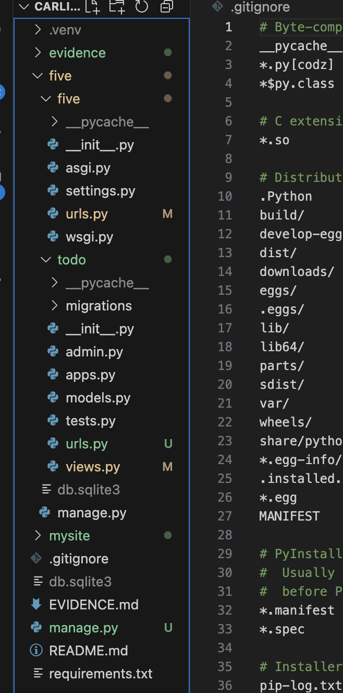

# Development Environment Evidence

- **IDE**: VS Code 1.94
- **Python Version**: 3.11.x
- **Virtual Environment**: Created with `python3 -m venv .venv`
- **OS**: macOS 13
- **Installed Packages**: See requirements.txt

## Screenshots

