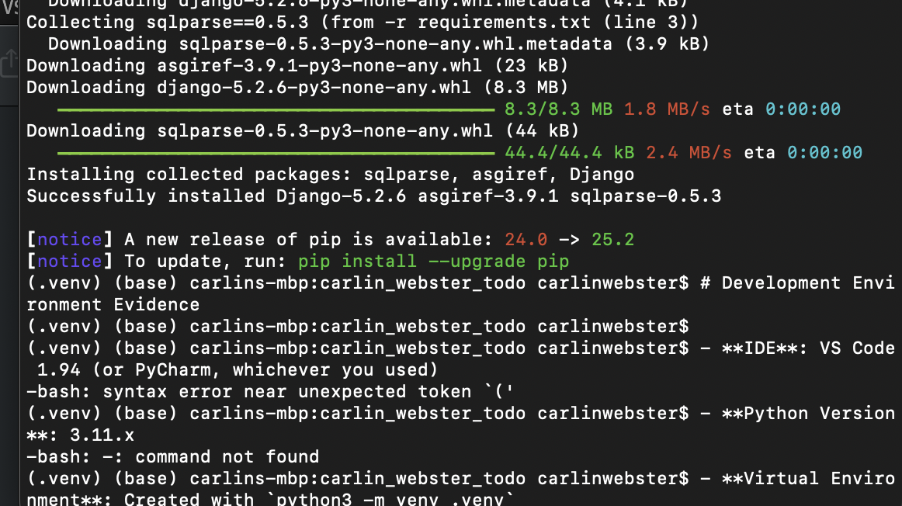
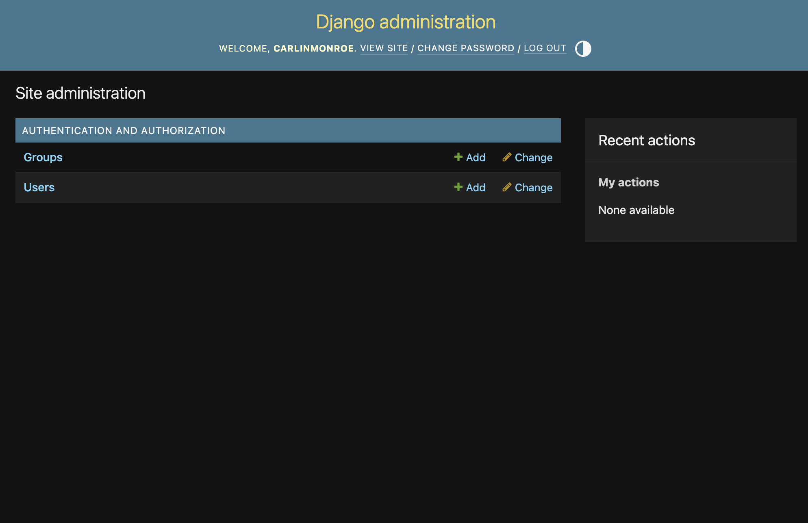
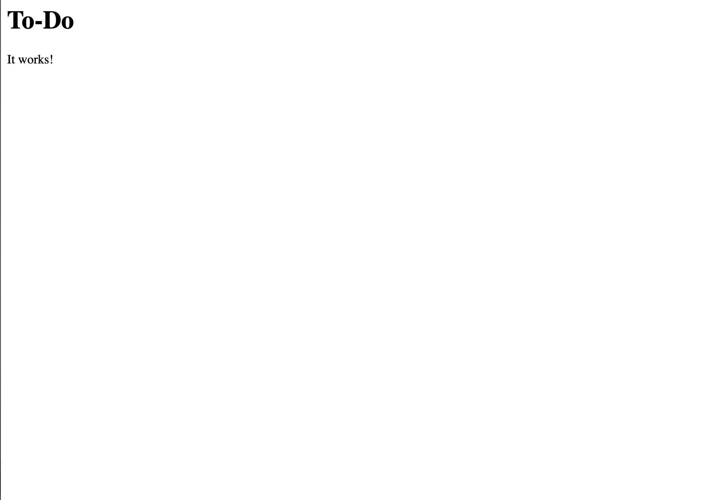

# Todo App (five)

## Development Environment
- **IDE**: VS Code 1.94
- **Python Version**: 3.12.x
- **Virtual Environment**: Created with `python3 -m venv .venv`
- **OS**: macOS 13
- **Installed Packages**: See [requirements.txt](requirements.txt)

## Evidence

### IDE

### Python Environment

### Admin Dashboard

### App Running

